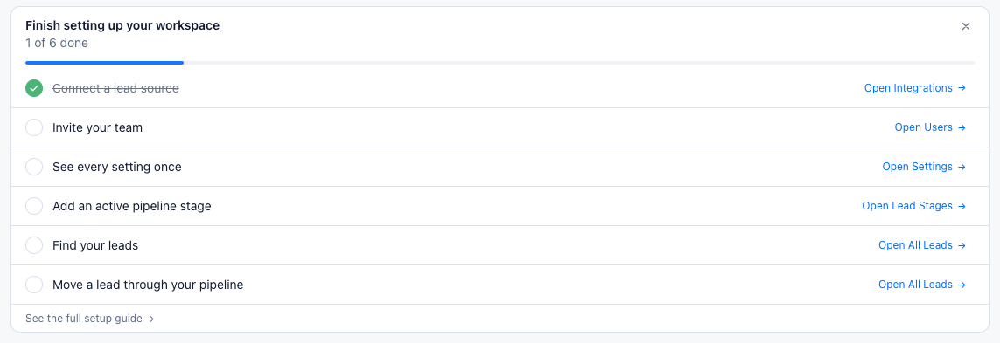
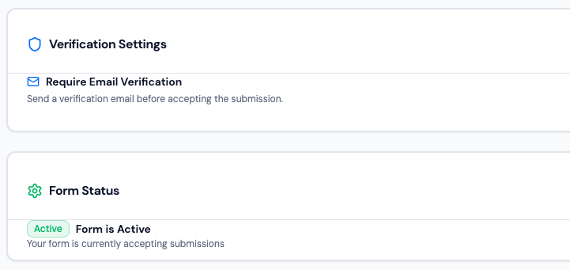
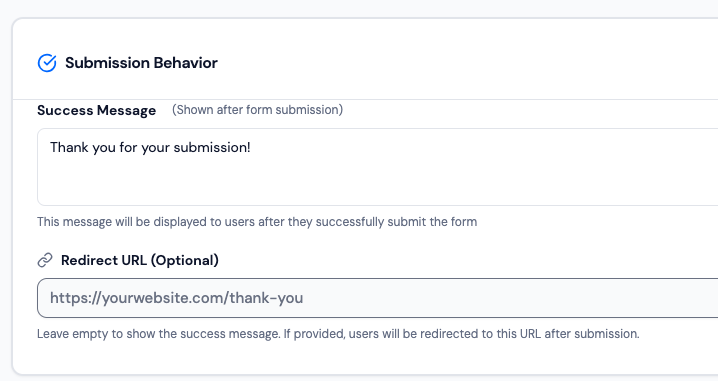
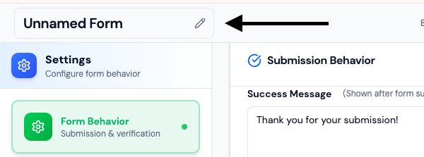

# Onboarding Checklist Fix

This is a fix version for **Finding 3: Setup checklist items are not clickable as expected**.

**Section:** Admin Dashboard Onboarding Checklist

Clicking a task label now toggles its checkbox, with immediate feedback in the completion count and progress bar.

**Reference:** [Admin dashboard](https://app.leadzam.com/dashboard/admin)

## Audit Findings & Scope

Four findings were identified during the audit. This project implements **Finding 3** only; the other findings are documented as future work and were not changed.

1. **Finding 1 - Inconsistent spacing between card title and content (Medium):** On [Forms](https://app.leadzam.com/dashboard/forms), Form Behaviour, the gap between the card title and its content feels excessive. Use consistent spacing between card titles, dividers, and content.

	
	

2. **Finding 2 - Form name input has inconsistent sizing (Low-Medium):** On [Forms](https://app.leadzam.com/dashboard/forms), Form Behaviour, the form name control appears oversized. Adjust its font size, width, and padding while accommodating longer names.

	

3. **Finding 3 - Setup checklist items are not clickable as expected (High, implemented):** On the [Admin dashboard](https://app.leadzam.com/dashboard/admin), clicking task text now toggles its checkbox and updates completion progress immediately.
   

https://github.com/user-attachments/assets/c4c1f537-3a75-48a1-a1c6-3c37bba451d3

4. **Finding 4 - Significant layout shift after data loads (High):** On [Forms](https://app.leadzam.com/dashboard/forms), View Forms, the table shifts down after data loads. Reserve space for loading content or use skeletons to prevent layout shift. [Video](https://drive.google.com/file/d/1t5399OSLAbVWGGWYvtNpO0sfspoM9Q0k/view?usp=sharing).

## Design Rationale & Trade-offs

### 1. What was the biggest UX problem, and why?

The biggest issue was the setup checklist interaction. Clicking a task's text did not update its checkbox, making completion unclear and potentially frustrating for users setting up their workspace.

### 2. Why prioritize this problem?

Workspace setup is an important first-time user experience. Confusing interactions can discourage users and make onboarding feel more difficult than necessary.

### 3. What was intentionally not redesigned?

The wider LeadZam application, unrelated pages, and existing workflows were left unchanged. The work focuses on one specific interaction rather than redesigning the entire product.

### 4. What trade-offs were made?

Due to time constraints, product exploration, documenting UX findings, and frontend implementation were prioritized. The Figma redesign was not completed and remains a limitation of this submission.

### 5. How does the redesign improve the user's task?

Clickable task labels make checklist interactions clearer and provide predictable feedback, helping users understand and complete workspace setup with less confusion.

### 6. What should be validated before production?

Test whether users understand checklist completion, verify checkbox and task-label behavior, and measure onboarding completion rates, setup time, and interaction errors.

### 7. What would be improved with another two hours?

Complete the Figma redesign, add relevant interaction and edge states, test across screen sizes, and improve keyboard accessibility and task-completion feedback.
